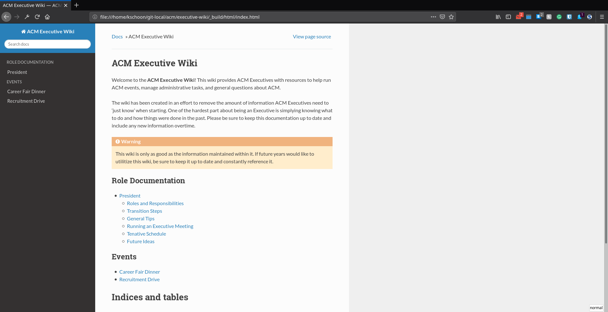

# executive-wiki
Wiki for ACM Executive Board to help with running ACM.

## Building the Documentation
+ Install [Python 3](https://www.python.org/downloads/)
+ Install pipenv
```
pip install pipenv
```
+ Enter the virtual environment
```
cd <github-repo>/
pipenv shell
```
+ Build the documentation
```
make html
```
+ Open the documentation in your web browser. Should look like:

