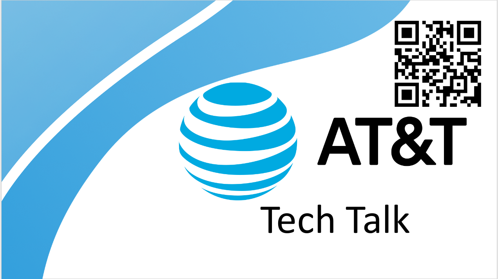
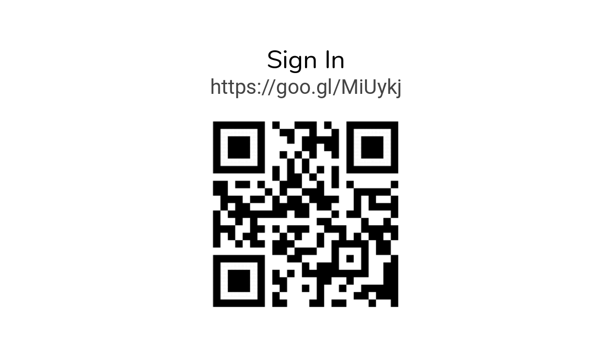
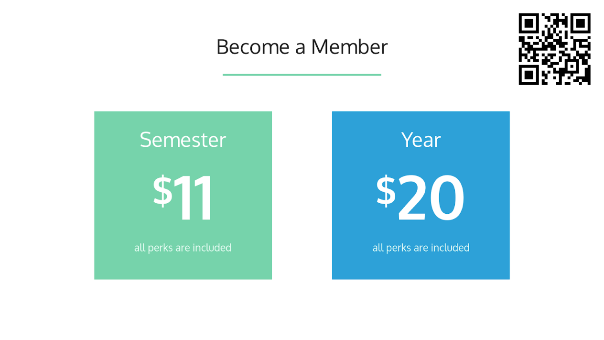

Technical Talks
===============
ACM should attempt to host at minimum 6 technical talks (February, March, April,
September, October, and November) from various companies, students, or
individuals that discuss a technical topic students would find interesting and
able to learn from.

Event Slideshow
----------------
The Event Slideshow is displayed on the projector at the beginning of ACM
General event. The slideshow should roughly have the following components ( Feel
free to change the components as you feel necessary):

1. Introduction Slide

2. Sign-in Page

3. ACM Membership Perks Page

.. image:: imgs/slideshow-perks.png
   :alt: Sign-in Page
   :scale: 35%
   :align: center

4. ACM Membership Price Page

5. Sponsors Page

.. image:: imgs/slideshow-sponsors.png
   :alt: Sponsors Page
   :scale: 35%
   :align: center

.. _events-tech_talks-create:

Creating the Slideshow
^^^^^^^^^^^^^^^^^^^^^^
1. Navigate to a previous event that has used the slideshow template (`Example
   used above
   <https://drive.google.com/drive/u/1/folders/1PCXmkzmtBgy_hfyP7vwfhxF1Prfk1wIQ>`_).
2. Right Click the presentation > Make a Copy.
3. Right Click the copied presentation > Rename > Move the presentation to the
   new event folder.
4. Update the **Introduction Slide** and **Sign-in Page** with the current
   event's information.

.. _events-tech_talks-signin:

Sign-in Form
------------
**TODO**

General Preperation
-------------------

3 Months Before
^^^^^^^^^^^^^^^
+ **Invite companies** - Begin to email companies you believe will have
  interesting topics and speakers. Ask them if they would be interested in
  coming on campus or giving a virtual talk as well as providing food.

.. warning::
   Virtual talks are usually harder to orchestrate and do not bring in the same
   volume of crowd.

2 Weeks Before
^^^^^^^^^^^^^^
+ **Order Food** (Optional) - If you plan on having food for the event, send out
  the order with the estimate how how much food you will need. Order to the food
  to show up 5-15 minutes before the event. Some good tools for estimating:
  `Pizza Calculator
  <https://calculate-this.com/how-many-pizzas-buy-calculator>`_.
+ **Reserve Room** - Login to orgsync and reserve the room you plan on hosting
  the event.
+ **Create Advertisement** - Develop the advertisement for the event such as
  flyers.

1 Week Before
^^^^^^^^^^^^^
+ **Distribute the Flyer** - See the
  :ref:`general-marketing_and_branding-resources` section for more information.
+ **Create Check-In Form** - See the :ref:`events-tech_talks-signin` secction
  for more information.
+ **Create Event Slideshow** - See the :ref:`events-tech_talks-create` section
  for more information.

Day Of
^^^^^^
+ **Setup Room** - Display the Event Slideshow on the screen and show up early
  to collect / setup the food

Sample Agenda
-------------
Generic Agenda for an Technical talk that starts at 6 pm.

+ **5:45** - Arrive at the room and begin setting up.
+ **5:50** - The Speaker arrives. Introduce yourself and thank them for coming
  to give the talk. Explain roughly what the agenda will be for the event.
+ **6:00** - Thank everyone for coming and briefly talk about ACM. Use the Event
  Slideshow as your main talking points.
+ **6:03** - Pass talking to the speaker and give them a round of applause.
+ **6:04** - Technical Talk begins.
+ **6:50** - Technical Talk ends and all questions are answered. Ask the crowd
  for another round of applause for the speaker and thank them one last time.
+ **7:00** - Cleanup the room.
