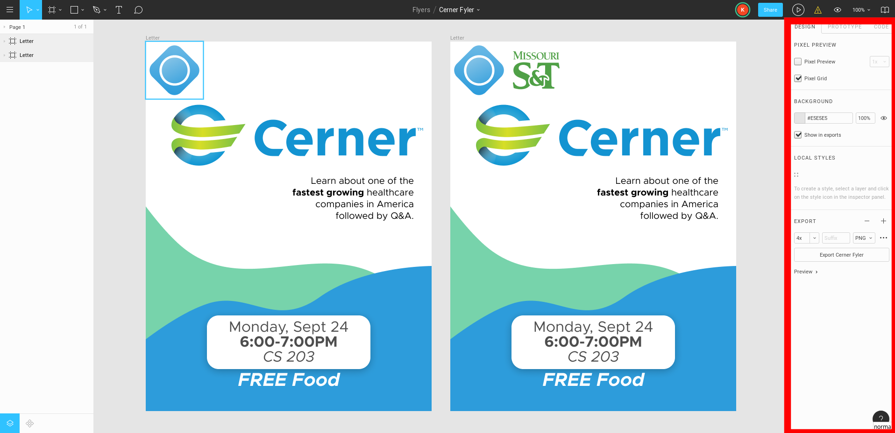
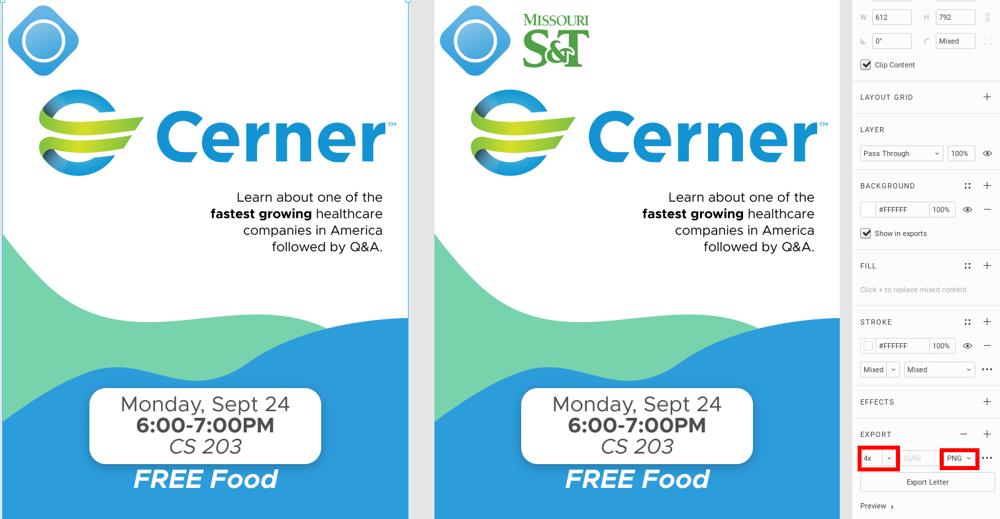

Marketing + Branding
====================
This section hopes to provide some basic information how how ACM does various
marketing and branding items like making fliers, ordering marketing equipment,
branding rules, etc.

.. _general-marketing_and_branding-resources:

Marketing Approaches + Resources
---------------------------------
1. **CSTask** - You can send your flyers or advertisements to cstask (email
   maintained by the CS Office staff). They will print the number of flyer
   copies you request and can also send the flyer or advertisements to all
   computer science students. Ask the current President or the CS Office Staff
   for the email address for cstask.
2. **ACM Google Groups** - ACM maintains multiple google groups with student
   emails depending on the different perferences. You should send any
   advertisements or flyers to the pertaint list. Ask the current President for
   more information.
3. **Hanging Flyers** - Various buildings will allow you to hang flyers or
   advertisements up. See the :ref:`general-marketing_and_branding-locations`
   section for more information.
4. **Word of Mouth** - Definitely the most powerful form of advertisement.
   Send out personal invitations to people you think who would be interested in
   coming or have people themselves spread the word. Most people will ignore
   emails or flyers but are much more likely to come when directly invited

Flyers
-------
The majority of the marketing efforts for ACM is through flyers. Whenenver ACM
hosts an event, an effort should be made to design, develop, and post flyers
around the pertinent school buildings so that students can be made.

.. note::
   Certain buildings will only allow you to hang fliers if there is the
   Missouri S&T logo somewhere on that flier. Moreover, before you hang up a
   flyer in any building, be sure to ask the front office for permission.

.. _general-marketing_and_branding-locations:

Hanging Locations
^^^^^^^^^^^^^^^^^
Please see the table below for the buildings we have hung flyers in, the number
of flyers necessary for the building, and if you need approval to hang items in
the building.

If you need tape to hang the flyers, ask the CS Office.

.. note::
   Most buildings have designated boards where students must hang flyers. Please
   do not deviate from these areas as they may no longer allow students to hang
   flyers.

====================================  ================  ==============================
Location                              Number of Flyers  Approval Required?
====================================  ================  ==============================
Computer Science (CS)                 25                Ask CS 327
Thomas Jefferson (TJ)                 18                Ask front desk, they will hang
Emerson Electric (EE)                 3                 Ask office supervisor
Residental Commons 1 & 2 (RC1 & RC2)  14                Ask front desk, they will hang
University Commons (UC)               10                Ask front desk, they will hang
====================================  ================  ==============================

Creating Flyers
^^^^^^^^^^^^^^^
This section will show how to create flyers for ACM.

Canva
"""""
`Canva <https://www.canva.com/>`_ is a very beginner-friendly, no design skills
necessary tool for creating fliers. I will not go into to much detail onto how
to use it, but create an account using your S&T email and play with it until you
are comfortable.

Manually
""""""""
Canva is wonderful, but if you're an able designer it will probably be more
effective to create your own. You can use a tool like `Adobe Photoshop
<https://www.adobe.com/products/photoshop.html>`_, `Adobe Illustrator
<https://www.adobe.com/products/illustrator.html>`_, or `Figma
<https://figma.com/>`_. We prefer **Figma** because it is free for students.
The remainder of this section will focus on **Figma**.

The first step to using Figma is asking the current President or Chair of ACM Web to
add you to the *Missouri S&T ACM* Figma group. The design group contains all
previous flyers with Figma and other ACM assets useful in the creation of
marketing materials. When you are added to the group, you can either copy an
old flyer as a template or create a brand new design.

When you are finished, you can export the design to:

1. Select the frame, choose **PNG** as your export method, and set scaling to
   **4x** or greater (the **4x** or greater makes the image have a very high
   resolution).

2. (**Linux** and **Mac**) Use the tool ``convert`` to change png to pdf.
   (**Windows**) Use `online tool <https://png2pdf.com/>`_ to convert png to
   pdf.

   .. code-block:: console

      $ convert --quality 100 <file>.png <file>.pdf

Retractable Banner
------------------
We have a `33" x 86" retractable banner
<https://www.vistaprint.com/signs-posters/retractable-banners?xnav=swsProductOnly_ResultTitle>`_
from `Vistaprint`_.

The design is located in **Figma** (`Branding Figma`_).  The banner is currently
located in the **ACM office** in a carry bag.  Assembly instructions can be
found `here <https://www.youtube.com/watch?v=kmH6jqQ882Q>`_

Custom Tablecloth
------------------
We have a `6', all over print, 3 sided custom tablecloth
<https://www.vistaprint.com/signs-posters/tablecloths?xnav=swsProductOnly_ResultTitle>`_
from `Vistaprint`_.  with 2 sets of `tablecloth clamps
<https://www.vistaprint.com/signs-posters/accessories/tablecloth-clamps?xnav=swsProductOnly_ResultTitle>`_.

The design is located in **Figma** (`Branding Figma`_).  The tablecloth is
currently located in the **ACM office** in the **ACM** labeled drawer. Please
properly fold the table cloth and put it back in this drawer after every use.

ACM T-Shirts
------------

Design
^^^^^^
To design the front of the shirt, ACM hosts a student design contest every year
starting at the end of August. The contest should be finished by mid-September
so that shirts can be ordered in a timely manner. However, if you are still
waiting on sponsorship confirmation for logos on the shirt, this can and should
be delayed. More information about running the design contest can be found in
:ref:`events-tshirt_design_contest-header`.

The back of the shirt is designed by the officers and should at minimum have:

1. Mention of the `ACM Website <https://acm.mst.edu>`_
2. Logos of the sponsors

Previous designs can be found in the below table:

===========  ========================================= ============================  ==============================================================================
Year         Vendor                                    Site Design                   Raw Design
===========  ========================================= ============================  ==============================================================================
2018 - 2019  `Custom Ink`_                             See old `Custom Ink`_ orders  `raw fs18 <https://www.figma.com/file/WKbFOiusMVxivbhtd8v8oqjW/ACM-T-Shirts>`_
===========  ========================================= ============================  ==============================================================================

Vendors
^^^^^^^

Custom Ink
""""""""""
`Custom Ink`_ is ACM's primary provider of shirts.
They are an officially licensed Missouri S&T t-shirt vendor so please note that
they will send all designs to be approved by branding before they will print
them.

Missouri S&T Branding Guidelines
--------------------------------
We are called S&T ACM.  This is because of the Missouri S&T branding committee's
rules.  When making marketing materials, be sure to always adhear to the very
strict rules made by the `branding team <https://brand.mst.edu/>`_.  If you have
questions, contact the branding committee by email or in their office.

+ MST is only acceptable in URLs and email addresses. Use SandT for any cases in
  which you do not have access to the ampersand character. (Twitter, Facebook)
+ Don't use any Missouri S&T branding on S&T ACM T-Shirts unless you plan to
  discuss with branding first.
+ Missouri S&T might try to force S&T ACM to switch its websites to Wordpress
  again at some point. Do not entertain this idea. Contact Dr. Patrick Taylor
  for advice in this regard.

.. _Custom Ink: https://www.customink.com
.. _Branding Figma: https://www.figma.com/file/YLWV5pKyP4Yons5A6dJyqCmb/ACM-Branding-Materials?node-id=0%3A1
.. _Vistaprint: https://www.vistaprint.com
