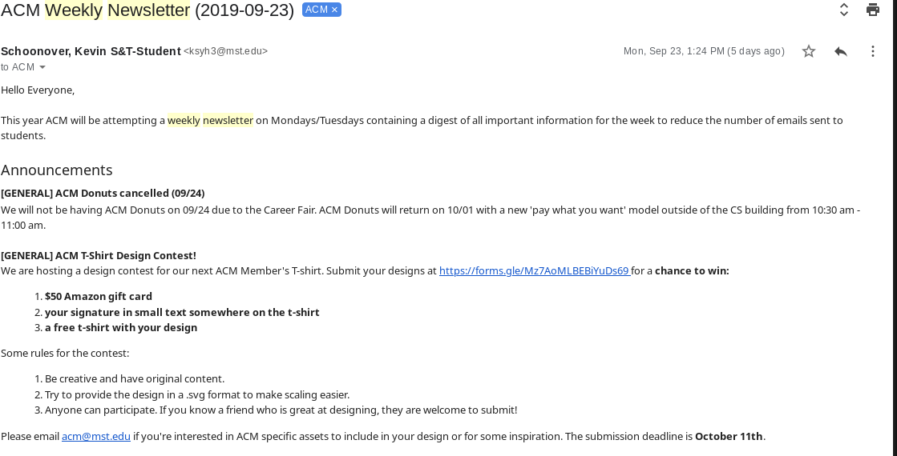
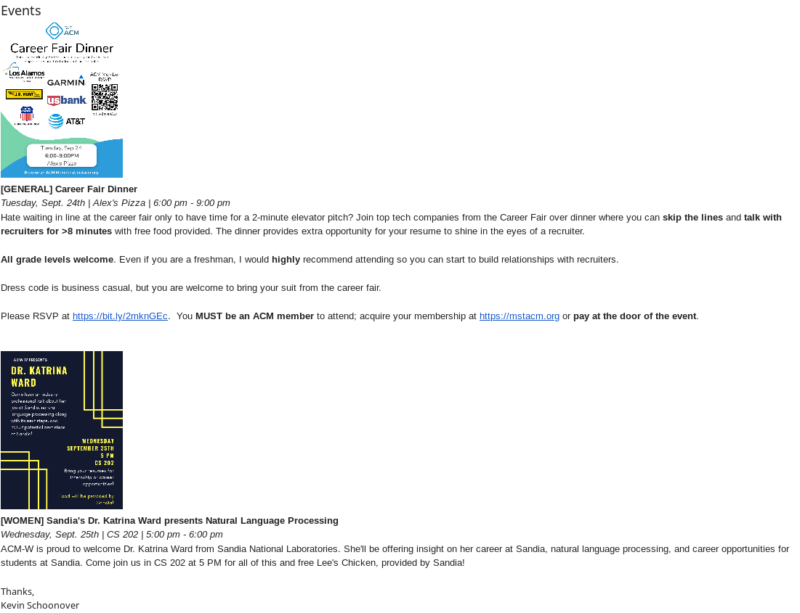

.. _general-newsletter:

Weekly Newsletter
=================
ACM maintains a weekly newsletter to students to reduce the amount of email spam
they receive from us to hopefully prevent email list blocking. This
documentation will discuss how to setup the newsletter and what to put in it.

Anatomy of the Newsletter
-------------------------
The newsletter is currently composed of three primary parts:

    + **Preamble** - Text that states 'This year ACM will be
      attempting a weekly newsletter on Mondays/Tuesdays containing a digest of
      all important information for the week to reduce the number of emails sent
      to students'. This is important so that student feel invested in keeping
      the newsletter since we are invested in reducing the spam they receive.
    + **Announcements** - Anything of general importance which should be
      announced to all students/ACM members such as the t-shirt design contest,
      new features on the website, etc.
    + **Events** - All events occurring during the current week or any major
      events that will occur within the next month or so. One thing to note
      about the events section is that you should attempt to embed a jpg of the
      flier into the actual email itself to allow students to see it / read it
      directly. See below for an example.

Example
^^^^^^^
Preamble + Announcements
""""""""""""""""""""""""""""""""

Events 
""""""

Sources of Information
----------------------
The best place to find information important to the newsletter will always be
talking to the ACM Officers to see if they have anything they want to put in the
newsletter. However, some additional places include:

    + **ACM Website** - The webiste should be up-to-date with all of the latest
      events along with fliers and other important information.
